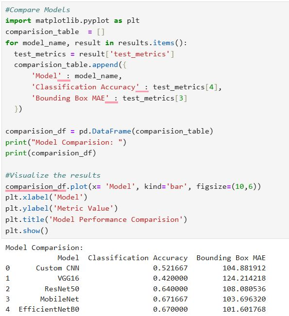
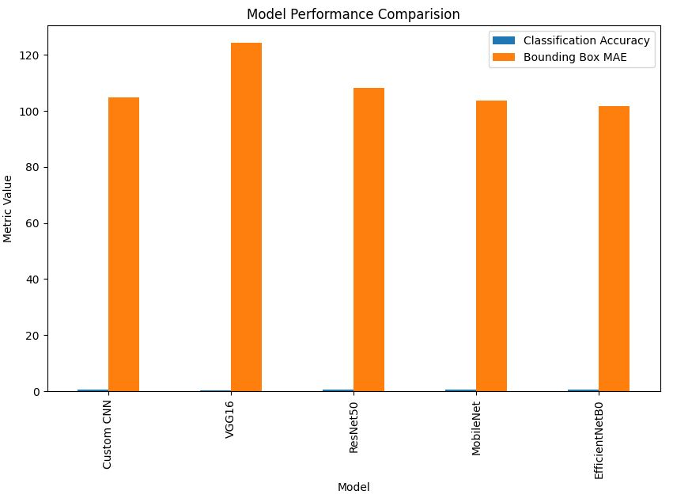
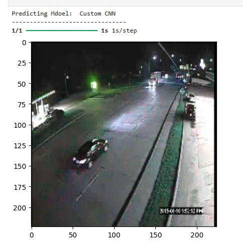
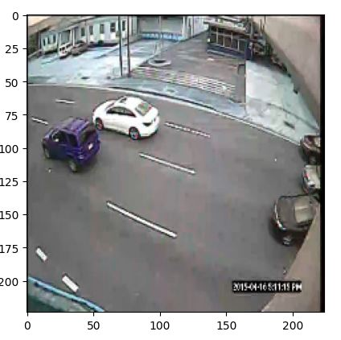

# Autonomous Driving AI

## Project Overview
This project focuses on vehicle detection and localization for autonomous driving systems using deep learning and computer vision techniques.

## Business Problem
Autonomous vehicles require real-time vehicle detection and localization to improve road safety, traffic monitoring, and intelligent transportation systems. This project develops deep learning models capable of identifying vehicle types and predicting bounding box coordinates from road images.

## Dataset
- 3000 traffic surveillance images
- 11 vehicle categories including cars, buses, trucks, motorcycles, bicycles, and pedestrians
- Bounding box coordinates for object localization
- Images resized to 224×224 pixels for model training

## Technologies Used
- Python
- TensorFlow
- Keras
- OpenCV
- NumPy
- Pandas
- Matplotlib

## Models Implemented
- Custom CNN
- VGG16
- ResNet50
- MobileNet
- EfficientNetB0

## Results

| Model | Classification Accuracy | Bounding Box MAE |
|---------|---------|---------|
| Custom CNN | 52.17% | 104.88 |
| VGG16 | 42.00% | 124.21 |
| ResNet50 | 64.00% | 108.08 |
| MobileNet | 67.17% | 103.70 |
| EfficientNetB0 | 67.00% | 101.60 |

### Best Performing Model
MobileNet achieved the highest classification accuracy of approximately 67.17%.

## Key Findings

- MobileNet achieved the highest classification accuracy (67.17%).
- EfficientNetB0 achieved the lowest bounding box error (101.60 MAE).
- Transfer learning models outperformed the custom CNN baseline.
- Deep learning architectures successfully classified and localized vehicles in traffic images.

## Project Outputs

### Model Comparison

### Performance Chart

### Vehicle Detection Results

## Future Improvements

- Implement YOLOv8 for real-time object detection.
- Increase dataset size through data augmentation.
- Deploy the model using Streamlit.
- Optimize inference speed for edge devices and autonomous systems.

## Author
Khalandar Noor Ahmed
